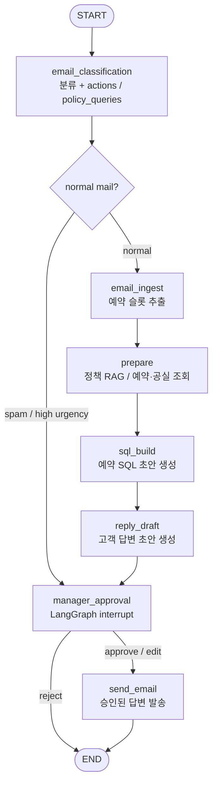

# 호텔 메일 사무자동화 에이전트

호텔 고객 메일을 **분류 · 정보 추출 · 규정 RAG · 예약 SQL 초안 생성 · 답변 초안**까지 처리하고, 매니저 승인 후에만 회신을 보내는 LangGraph 기반 LLM 에이전트입니다.

코로나19 이후 호텔·숙박 업계의 인력 공백이 충분히 회복되지 않으며 구인난이 이어지고 있습니다. 반복적인 메일 응대·예약 문의 처리는 현장의 분명한 페인 포인트이고, **Human-in-the-loop를 포함한 사무자동화**가 그 부담을 줄일 수 있다고 판단해 이 프로젝트를 선정·구현했습니다.

---

## Demo

> 시연 기간 동안 관리자 승인 사이트를 공개 운영할 예정입니다. URL은 아래에 업데이트합니다.

- **Live Demo**: `[데모 URL — 추후 기입]`
- **시연 흐름**: 수신 메일 선택 → 에이전트 실행 → 승인 화면에서 draft/SQL 검토·수정 → 승인/반려 → 답변 메일 발송

### 스크린샷

<!-- 이미지 경로를 채운 뒤 주석을 해제하세요 -->

```text
[스크린샷 1] 수신 메일 목록 / 실행
[스크린샷 2] 매니저 승인 화면 (분류 · draft · SQL)
[스크린샷 3] 승인 후 발송 결과
```

<!--


-->

---

## Features

- **메일 분류**: spam / high urgency / normal, 필요 시 즉시 매니저 승인으로 라우팅
- **의도·슬롯 추출**: 예약 create/update/delete/search 액션, 투숙객·일정 등 `extract_data`
- **정책 RAG**: 호텔 규정 문서(Chroma + BGE-M3)에서 `policy_queries` 기반 검색
- **예약 SQL 초안**: 조회·공실·기존 예약 컨텍스트를 반영한 create/update/delete SQL 생성
- **답변 초안 + HITL**: LangGraph `interrupt`로 승인·반려·수정 후 resume
- **실메일 연동**: Gmail IMAP 수신 · SMTP 발송 (제목 태그 `[hotel]` 필터)
- **관리자 UI**: FastAPI + React로 승인 큐·상세·수정·실행 결과 확인
- **정량 평가**: LangSmith Exact Match 파이프라인 (`mail_dataset.jsonl` 108건)

---

## Architecture



비즈니스/시스템 오류는 그래프를 강제 종료하지 않고 state에 기록한 뒤 매니저 승인 노드로 넘깁니다.
React 승인 UI는 FastAPI 실행/조회/승인 API를 통해 그래프 실행 상태를 확인하고, 승인·수정 결과를 LangGraph `resume`으로 다시 주입합니다.

### 디렉터리

```text
app/
  graphs/          # LangGraph 노드 · 엣지
  api/             # FastAPI (실행 · 승인 resume)
  rag/             # 규정 파싱 · 벡터 적재
  evaluation/      # LangSmith 업로드 · EM 평가
  services/        # 메일 · DB · 벡터스토어
frontend/          # React 매니저 승인 UI
resources/         # 평가 데이터셋 · 규정 문서 · mock
tests/             # interrupt / API / 발송 등
```

---

## Tech Stack

| 영역 | 기술 |
|------|------|
| Agent | LangGraph, LangChain, OpenAI (`gpt-4o-mini`) |
| Observability / Eval | LangSmith |
| RAG | LlamaCloud 파싱, Chroma, `BAAI/bge-m3` |
| Backend | FastAPI, Uvicorn |
| Frontend | React, TypeScript, Vite |
| Data | SQLite (예약 mock DB), JSONL 평가셋 |
| Mail | Gmail IMAP / SMTP (앱 비밀번호) |

---

## Evaluation

최대한 다양한 호텔 고객 메일 시나리오를 포함한 **golden dataset 108건**을 직접 구성했습니다.  
데이터셋은 spam / high urgency / normal 분류, 예약 생성·변경·취소·조회, 규정 문의, 복합 의도, 성공/실패 케이스를 포함합니다.

LangSmith 평가를 총 **11회 반복**하며 실패 케이스를 분석하고 프롬프트·라우팅·상태 처리 기준을 개선했습니다.  
최종적으로 전체 metric에서 목표 기준 **0.90**을 상회했습니다.

| Metric | AVG |
|--------|-----|
| `action_match` | **0.94** |
| `classification_match` | **0.98** |
| `extract_match` | **0.92** |
| `outcome_match` | **0.92** |
| `policy_queries_presence_match` | **0.93** |

### Metric 기준

- `action_match`: 예측한 예약/정책 처리 액션 집합이 golden actions와 정확히 일치하는지 평가
- `classification_match`: 메일 category와 urgency가 golden classification과 일치하는지 평가
- `extract_match`: 이름, 체크인, 체크아웃 등 핵심 예약 슬롯이 golden extract data와 일치하는지 평가
- `outcome_match`: 처리 성공 여부와 business error code가 golden expected outcome과 일치하는지 평가
- `policy_queries_presence_match`: 규정 RAG 검색이 필요한 메일에서 policy query 생성 여부가 golden 기준과 일치하는지 평가

- 데이터셋: `resources/mail_dataset.jsonl` (108 samples)
- 실행: `python -m app.evaluation.run_eval_pipeline`

---

## Quick Start

### 요구 사항

- Python 3.11+ 권장
- Node.js 20+ 권장
- OpenAI API Key, LangSmith API Key
- (실메일 데모 시) Gmail 계정 + 앱 비밀번호
- (규정 인덱싱 시) LlamaCloud API Key

### 환경 변수

프로젝트 루트에 `.env`를 생성합니다.

```env
OPENAI_API_KEY=
LANGSMITH_API_KEY=
LANGCHAIN_TRACING_V2=true
LANGCHAIN_PROJECT=hotel-ai

# 실메일 수신/발송
GMAIL_SENDER=
GMAIL_APP_PASSWORD=
GMAIL_INBOX_SUBJECT_TAG=[hotel]
GMAIL_INBOX_MAILBOX=INBOX

# 규정 문서 파싱 (인덱싱 시)
LLAMA_CLOUD_API_KEY=
```

프론트엔드 API 주소(선택):

```env
# frontend/.env
VITE_API_BASE=http://127.0.0.1:8000
```

### 설치 · 실행

```bash
# 백엔드
python -m venv .venv
# Windows: .venv\Scripts\activate
source .venv/bin/activate
pip install -r requirement.txt

# (최초 1회) 예약 mock DB · 규정 벡터 인덱스가 없다면
python -m app.database.mock_db
python -m app.rag.split_vector

uvicorn app.api.main:app --reload --port 8000
```

```bash
# 프론트엔드 (다른 터미널)
cd frontend
npm install
npm run dev
```

브라우저에서 `http://localhost:5173` 으로 관리자 승인 UI에 접속합니다.

### 평가 · 테스트

```bash
python -m app.evaluation.run_eval_pipeline
pytest
```

---

## Limitations

- **예약 DB 실쓰기(`action_node`)는 의도적으로 미구현**입니다. 실행 시마다 DB 상태가 바뀌면 평가·시연 재현이 어려워지기 때문입니다. 생성된 SQL을 실행하는 단계는 상대적으로 단순하며, 필요 시 바로 연결할 수 있습니다.
- 데모/면접에서는 생성된 `action_sqlite`를 **참고용 SQL**로 답변 메일에 포함해, 에이전트의 예약 처리 의도를 보여 줍니다.
- 프로덕션급 인증·권한·멀티테넌시·대규모 동시성은 범위 밖입니다.

---

## More Reading

기술 블로그(설계 · 평가 개선 · HITL)는 작성 후 아래에 링크합니다.

- `[글 1 제목 — 추후 기입]`
- `[글 2 제목 — 추후 기입]`

---

## Author

LeeJaeBin · [GitHub](https://github.com/jb2002a)
